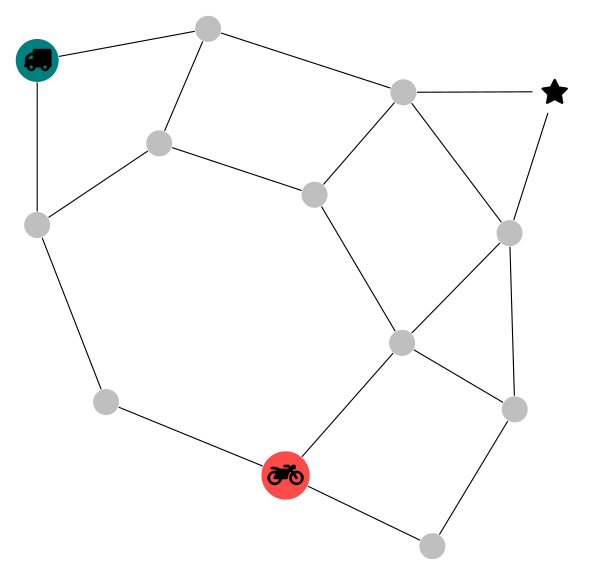

# FaMSeC
This is a repository for Factorized Machine Self-Confidence (FaMSeC). FaMSeC is a "self-assessment" *algorithmic assurance* ([see this paper][2]), and is meant to effect the how people interact with an autonomous system. The code here produces data that was used in [this experiment][3]. This code also, produced data for [this paper][4]. It is based around the idea of performing meta-analysis of a decision-making agent. This repository implements ![equation][xQ] and ![equation][xO]; other metrics have not yet been developed.

  

The overall goal of the code here is to : 1) generate "road-network" MDPs, and simulate the performance of different solvers on them; 2) calculate two of the FaMSeC metrics---"Solver Quality" (![equation][xQ]), and "Outcome Assessment" (![equation][xO]); 3) provide scripts for plotting different data and investigating the different properties of ![equation][xQ]. This is an example road-network:

  

## Requirements
The main code uses Julia `v0.6.3` with the following packages:

* `POMDPs.jl` (`v0.6.9`) and `POMDPToolbox` (`v0.2.8`) --- MDP and POMDP functionality
* `MetaGraphs.jl` (`v0.4.1`) --- for adding metadata to `LightGraphs.jl` graphs
* `JSON.jl` (`v0.17.2`) --- for reading/exporting `.json` files
* `PyPlot.jl` (`v2.6.3`) --- for creating plots with matplotlib (this requires matplotlib to be installed, but PyPlot takes care of this using an anaconda environment)
* `JLD` (`v0.8.3`)/`FileIO` (`v0.9.1`)  --- for binary file storage
* `ProgressMeter` (`v0.5.6`) --- for showing progress bars when running
* `MicroLogging` (`v0.2.0`) --- nice logging utility
* `Distributions` (`v0.15.0`) --- for working with random variables and distributions
* `StatsBase` (`v0.23.1`) --- basic statistics stuff
* `TikzGraphs` (`v0.6.0`)/`TikzPictures` (`v1.2.0`) --- for plotting graphs using Tikz
* `DataStructures` (`v0.8.4`) --- adds data structures (linked lists, queues, etc.)
* `DataFrames` (`v0.11.7`)/`CSV` (`v0.2.5`)--- dealing with reading and writing data in tables

The code for selecting the data set to be used in the experiment uses Julia `v1.0.0` (yes, I know this is very unfortunate, but that is how it is, and making either version compatible with the other isn't trivial, so I'm leaving it as-is)

* `LatinHypercubeSampling` (`v1.2.0`)---for sampling the xQ/xO space
* `JSON` (`v0.20.0`)---reading/writing `.json` files
* `PyPlot` (`v2.7.0`)---plotting
* `StatsBase` (`v0.27.0`)---basic statistics stuff
* `DataFrames` (`v0.17.0`)/`CSV` (`v0.4.3`)---dealing with reading and writing data in tables
* `TexTables` (`v0.1.0`)---making a nice summary table for publishing

## Process
When creating data "from scratch" this is the process that I followed; read the instructions carefully first, the end of step 1 is critical:

1. Run `make_nets_and_data.jl`, after adding the `experiment_name` to the `experiment_utilities.jl` file, and creating a corresponding experiment parameters file in the `experiment_params` folder, and following the format of other files in that folder. I typically did this on Google Cloud Platform using something like a 64 processor machine and a few hundred workers in julia (via `julia -p <number_of_workers>`).
This process results in `.jld` and `.csv` files in the `logs` directory. The `.jld` files contain the raw network definitions and simulations, the `.csv` files contain summary data used for creating the solver quality model.

* NOTE: After running the code you need to ***shut down the REPL*** before starting it up again for the step 2. This is due to an issue with the `.jld` library, it is unfortunate, but exists. ***Failing to do this can ruin the data that you just made (possibly ruining hours of processing)***

2. Run `make_experiment_data.jl`. This file can do three things:
    * Create the `.svg` figures for the experiment---this is done in the `imgs` folder by default.
    * Calculate xQ for each network, this will produce the SQ model if necessary (which will be necessary if you are starting from scratch)---this data is written into the relevant, existing, `.jld` file.
    * Export data to a `.json` file that can be used in the MTurk experiment---these files are saved in the `logs` folder by default.

    Any combination of these three tasks can be run at a time. All of them need to be run to have the complete set of data for an experiment, but you can skip one step or another if you are already happy with the data that has been produced (this came in handy when I was debugging the `.json` export, and ![equation][xQ]).

3. Run `svg_resize.jl` to "square-up" the `.svg` figures. I typically do this like so: from the root project directory run `julia svg_resize.jl`.

4. Using Julia `v1.0.0` run `make_experiment_dataset.jl` in the `experiment_analysis` folder---this helps select a small subset from a (fairly) large set of generated networks. It operates on the `.json` files created in step 2. This code produces two plots, and creates files that can be saved into the PsiTurk experiment directory.

    There is one pretty unfortunate part about this code: it runs on Julia `v1` instead of Julia `v0.6` like the previous code. This cannot be helped because of the necessary libraries, if it were simple I'd convert the other code from `v0.6`, but that isn't a priority right now.

**Note: Other `make_*` files are, or were at some point, self-sufficient but were wrapped into the above two files over time. The `plot_*` files are run to make specialty plots for different papers.**

## A Note About Notation
We used `X3` and `X4` in code because that was the original self-confidence notation. Later we changed the notation to `xQ` and `xO`, which is easier to follow, but we haven't replaced the old notation in the code yet...hasn't been a priority

## Description of Files
Following are some high-level descriptions of the different files. Small `README.md` files are found within each directory to indicate their use.

* `calc_xq.jl`---calculates the solver quality `xQ` value, used by `make_experiment_data.jl`
* `experiment_utilities.jl`---some basic utilities used by `make_nets_and_data.jl`
* `hellinger_test.jl`---file for investigating the properties and behavior of the Hellinger metric
* `juliarc.jl`---file that adds the current path to the julia environment so local modules can be loaded with `using` command
* `LICENSE`---MIT license file
* `logistic_tests`---file for investigating the properties of the general logistic function
* `make_experiment_data.jl`---After all networks have been created and simulations run, this code runs to make the data for the MTurk experiment. This means making the figures, calculating xQ (which has to be done after everything because we need to have the surrogate model), filtering out networks that are too dense or where the truck is too close to the exit, and simulating success/failures of deliveries on networks. This data is used for the MTurk experiment.
* `make_nets_and_data.jl`---This file is the main file to produce the simulation data. Here the networks are created and many simulations are run.  I ran this file on Google Cloud Platform so I could utilize many parallel processes. Otherwise this might take a ***really*** long time.
* `make_roadnet_figs.jl`---Called by `make_experiment_data.jl` to produce the `.svg` figures of the different road networks
* `make_SQ_model.jl`---
* `make_table_corr_plot.jl`---file used to make correlation plot of log files (found in `logs` folder). This is to help identify what variables are interacting to try and decide what variable to include in the surrogate model
* `network_library.jl`---file used to create different kinds of networks. The "original" road-network, and a "medium" network are here. Also code to make "random" networks that were used in the final experiments. Also some code to visualize a network. These aren't just "standard" networks, they specify things like exit nodes, and reward structures that are used in the MDP.
* `plot_mcts_depth.jl`---make box plots based on MCTS depth of the different solvers. This made figures in numerical simulations report that is on [ArXiv][1]
* `plot_root_comparison.jl`---Used to plot different fractional exponents when thinking about the $\alpha$ parameter of xQ
* `plot_rwd_dists.jl`---file used in `make_experiment_data.jl` to plot the `surprisesuccess` and `surprisefailure` figures.
* `prepend_preamble.tex`---this file is used by the `TikzGraphs` library in order to add special characters when making the road-network images. This enables the truck and motorcycle icons to be displayed
* `roadnet_MDP.jl`--- TODO: ADD THIS AT SOME POINT
* `Roadnet_MDP.jl`--- TODO: ADD THIS AT SOME POINT
* `roadnet_pursuer_driver.jl`--- TODO: ADD THIS AT SOME POINT
* `roadnet_pursuer_generator_MDP`--- TODO: ADD THIS AT SOME POINT
* `road_net_visualize.jl`---make an animation of a simulated run.
* `self_confidence.jl`---code for calculating both `xO` (`X4`) and `xQ` (`X3`)
* `send_mail.jl`---used for sending email when `make_nets_and_data.jl` is done running on Google Cloud Platform.
* `SQ_investigation.jl`---I don't think this file is used, but I haven't taken the time to check....
* `svg_resize.jl`---processes images in the `imgs` folder to make their aspect ratio square, save figures in `imgs/squared` folder
* `test_mxnet.jl`---script to make sure mxnet is working alright
* `test_pomdp_parallel.jl`---script to test parallel pomdps
* `utilities.jl`---some useful functions that I used in places, I don't think all of them are still used though, and some may not be finished. I think I abandoned them in the middle for a different approach (i.e. lhs).
* `visualize_medium_net.jl`---make plots of original and medium roadnets
* `X3_empirical.jl`---code for original development of X3
* `X3_test.jl`---code to produce more numerical simulations of X3 in action. This figure was used in several papers, and shows two GPs that cross over in different locations. The value of X3 is compared at different locations and for different "global reward ranges".

[1]:https://arxiv.org/abs/1810.06519
[2]:http://bisraelsen.site/assurances
[3]:https://github.com/COHRINT/SC_experiment
[4]:http://bisraelsen.site/SQ
[xQ]:http://latex.codecogs.com/svg.latex?x_Q
[xO]:http://latex.codecogs.com/svg.latex?x_O
